# Microsoft Entra Conditional Access MFA Lab

## Overview

This project demonstrates the design, implementation, validation, and troubleshooting of a Microsoft Entra Conditional Access policy intended to require multifactor authentication (MFA) for access to a protected cloud application.

The lab uses a fictional Finance employee, **Jordan Lee**, and a security group to scope Conditional Access rather than assigning the policy directly to an individual user.

The policy was deployed in **Report-only mode** to evaluate its expected impact before enforcement. Validation included Microsoft Entra's **What If** tool, application access testing, and investigation of Microsoft Entra sign-in logs.

The project demonstrates an important security engineering principle:

> A security control should not only be configured — its scope, expected behavior, and actual telemetry should also be validated before enforcement.

---

## Scenario

A fictional organization needs to protect access to its **Cloud Security Assessment Portal**.

Jordan Lee is a Finance employee who requires access to the application. Because the application represents a protected cloud resource, users within the designated security group should be required to perform multifactor authentication.

Rather than targeting Jordan directly, access control is managed through a security group:

**SG-CA-MFA-Required**

This creates a more scalable policy-assignment model where users can be added or removed from the protected population through group membership.

---

## Security Objective

The objective of the lab was to implement a Conditional Access control with the following design:

| Component | Configuration |
|---|---|
| Identity | Jordan Lee |
| Department | Finance |
| Security Group | SG-CA-MFA-Required |
| Protected Resource | Cloud Security Assessment Portal |
| Access Control | Require multifactor authentication |
| Deployment State | Report-only |
| Validation | What If + Sign-in Logs |

The intended access flow is:

```text
Jordan Lee
    ↓
SG-CA-MFA-Required
    ↓
Microsoft Entra Conditional Access
    ↓
Cloud Security Assessment Portal
    ↓
Require Multifactor Authentication
```

---

# Implementation

## 1. Create the Test Identity

A fictional internal user named **Jordan Lee** was created to represent a Finance employee requiring access to the protected application.

The account was configured as a standard member identity rather than an administrative account.

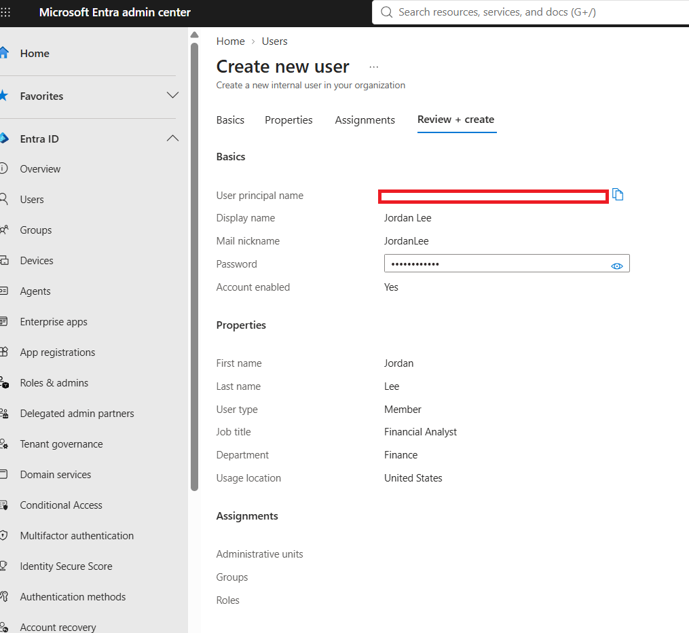

This separates the test identity from privileged administrative accounts and provides a realistic identity for Conditional Access validation.

---

## 2. Create the MFA Security Group

A security group named:

**SG-CA-MFA-Required**

was created to define the population subject to the MFA control.

The group was configured with assigned membership and described as containing users requiring multifactor authentication for protected cloud applications.

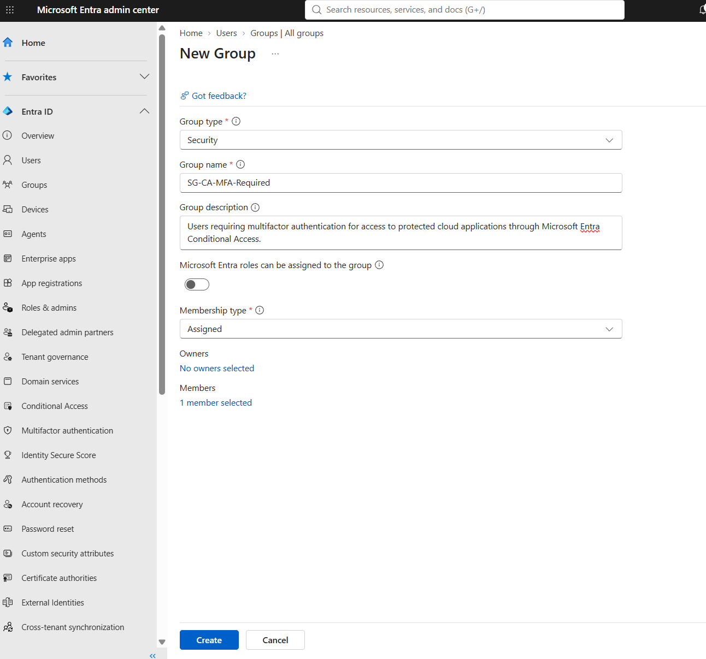

Using a security group rather than directly targeting an individual user provides a more scalable method for managing Conditional Access scope.

---

## 3. Add Jordan Lee to the MFA Group

Jordan Lee was added as a direct member of **SG-CA-MFA-Required**.

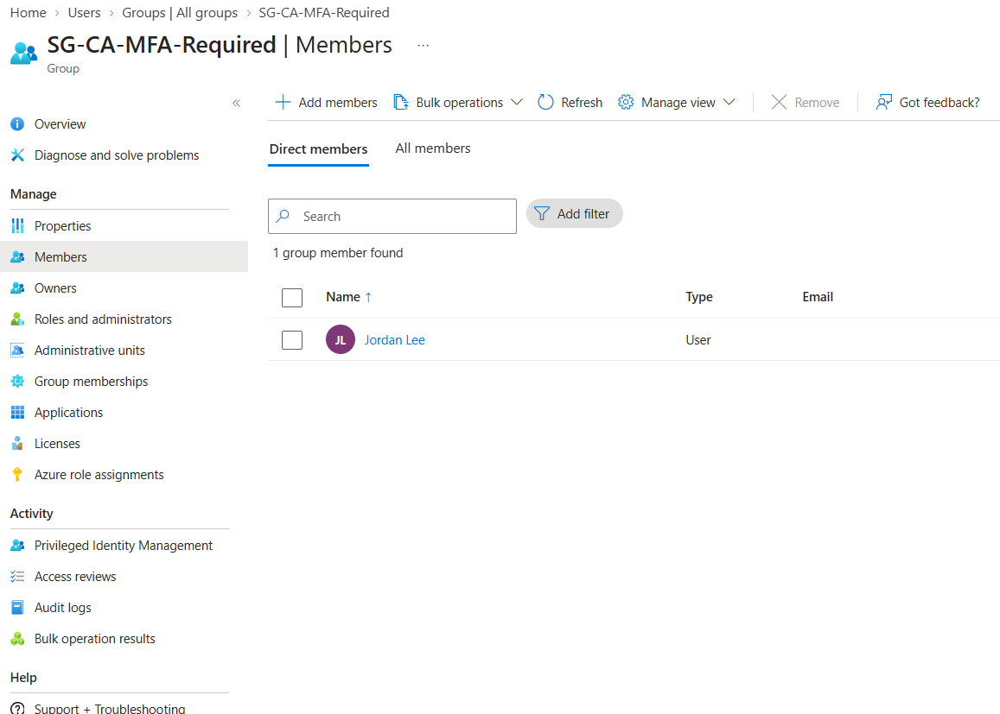

The resulting relationship becomes:

```text
Jordan Lee
    ↓
SG-CA-MFA-Required
    ↓
Conditional Access Policy
```

This separates the identity from the security policy itself and allows group membership to determine whether the user falls within the policy's identity scope.

---

## 4. Scope the Conditional Access Policy

A Conditional Access policy was created and scoped to:

**SG-CA-MFA-Required**

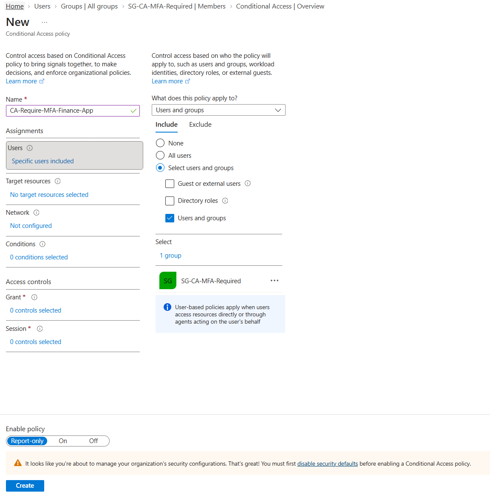

This ensures that the policy targets the designated security population instead of applying broadly across the tenant.

Targeted deployment reduces unnecessary impact and provides clearer control over which identities are affected.

---

## 5. Scope the Protected Resource

The policy was configured to target the specific enterprise application:

**Cloud Security Assessment Portal**

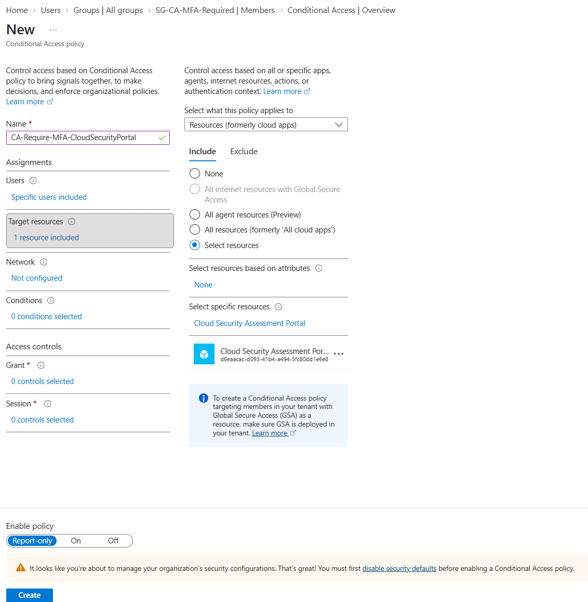

The policy therefore evaluates two important elements:

```text
WHO?
SG-CA-MFA-Required

WHAT?
Cloud Security Assessment Portal
```

Both assignments must match the authentication context for the policy to apply.

This distinction became important during later troubleshooting.

---

## 6. Create the Conditional Access Policy

The final policy was named:

**CA-Require-MFA-CloudSecurityPortal**

and deployed in **Report-only mode**.

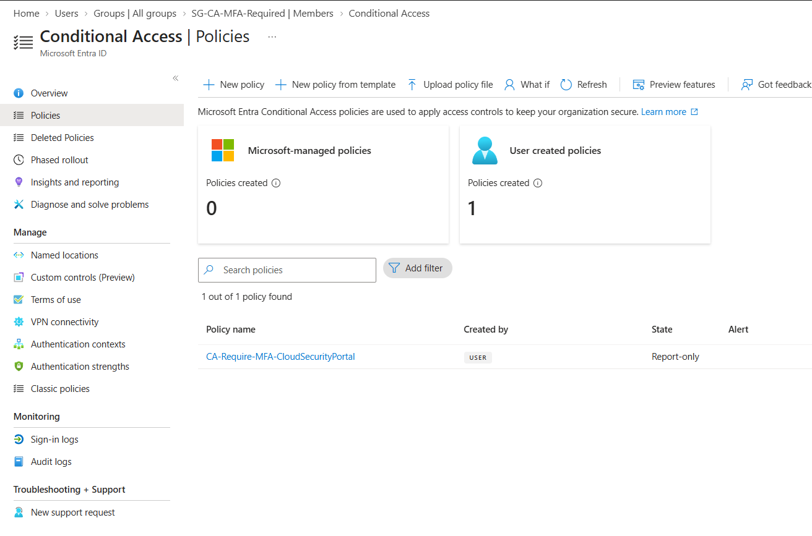

Report-only deployment allows administrators to evaluate how a Conditional Access policy would behave without immediately enforcing the control.

This reduces the risk of unintended access disruption or user lockout during initial validation.

---

## 7. Configure the MFA Grant Control

The policy's Grant control was configured to:

**Grant access → Require multifactor authentication**

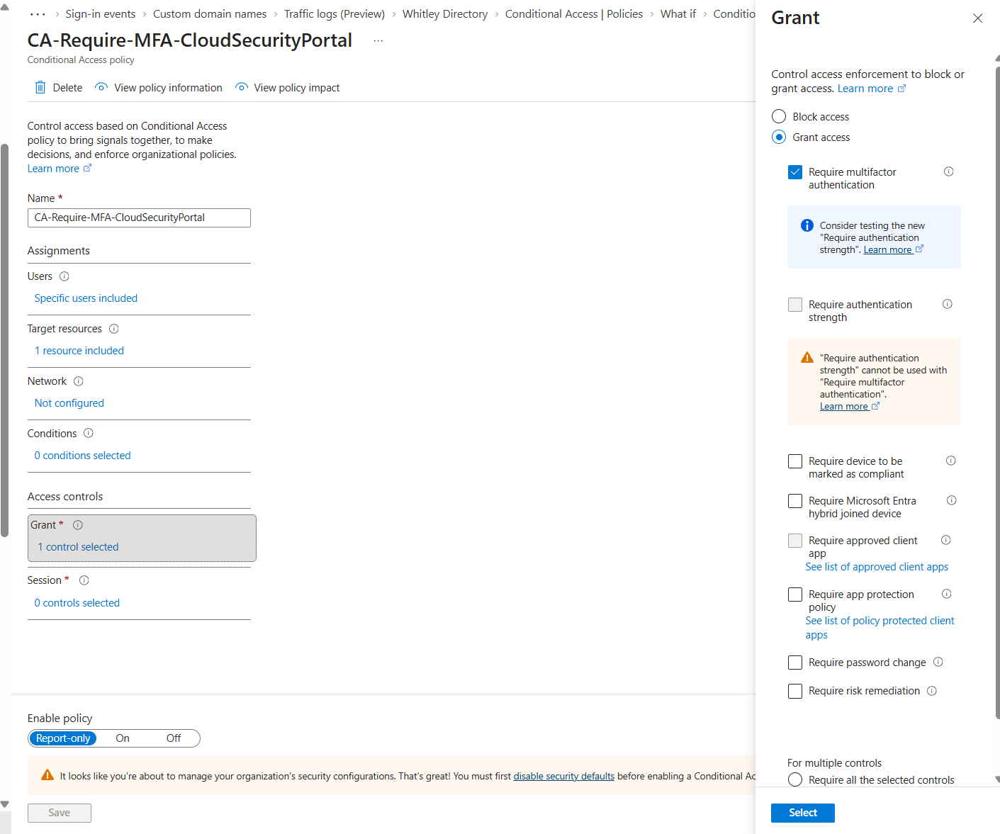

The resulting policy logic can be represented as:

```text
IF

User ∈ SG-CA-MFA-Required

AND

Target Resource = Cloud Security Assessment Portal

THEN

Require Multifactor Authentication
```

The policy remained in Report-only mode during testing.

---

# Policy Validation

## 8. Validate the Policy with What If

Before relying on live authentication behavior, the Microsoft Entra **What If** tool was used to simulate the Conditional Access decision.

The simulation evaluated Jordan Lee accessing the Cloud Security Assessment Portal through a browser.

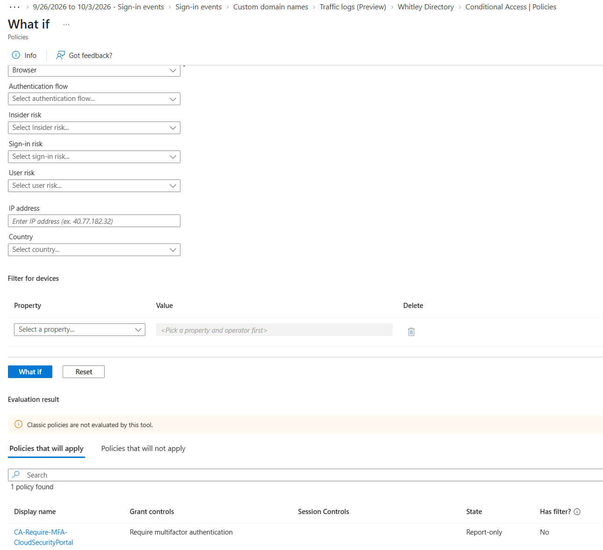

The simulation identified:

**CA-Require-MFA-CloudSecurityPortal**

as a policy that would apply and showed the expected grant control:

**Require multifactor authentication**

This confirmed that the configured identity, group membership, protected resource, and MFA control produced the intended policy evaluation.

---

# Real-World Access Testing

## 9. Verify Application Visibility

Jordan Lee was then used to sign in to the Microsoft My Apps portal.

The **Cloud Security Assessment Portal** appeared in the user's available applications.

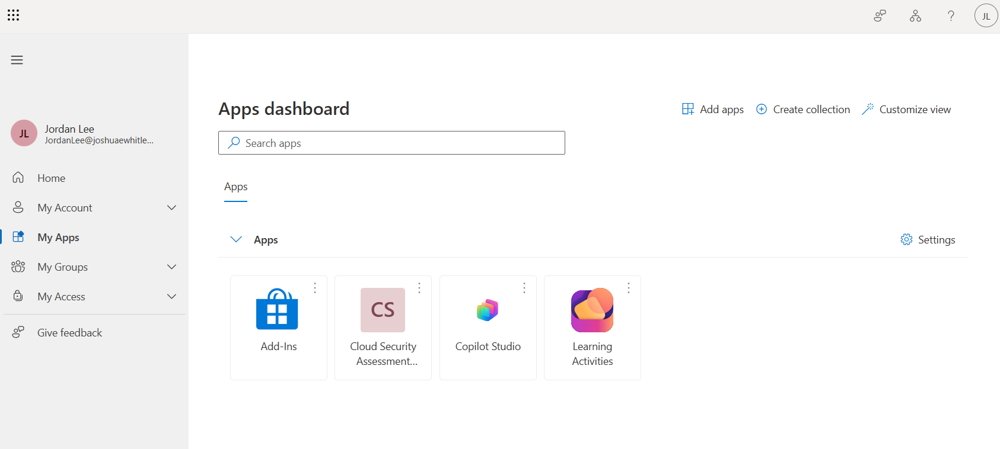

This confirmed that Jordan could see the enterprise application and provided a path for attempting a real application launch.

---

# Troubleshooting

## 10. Investigate Application Launch Failure

When Jordan attempted to launch the Cloud Security Assessment Portal, the application returned:

**App launch failed**

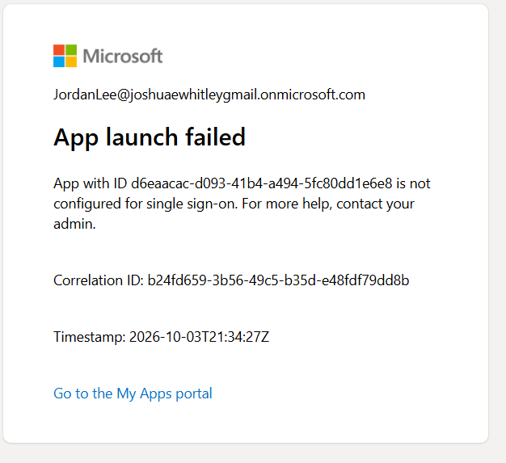

The error indicated that the enterprise application was **not configured for single sign-on**.

This distinction is important.

The failure did not demonstrate that the Conditional Access policy itself was incorrectly configured. Instead, the application could not complete the expected SSO launch flow required to perform the intended live application test.

Rather than treating the application error as evidence of successful MFA enforcement, the test was documented as an application configuration limitation and investigated through Microsoft Entra sign-in telemetry.

---

# Sign-In Log Investigation

## 11. Evaluate Report-Only Telemetry

Microsoft Entra sign-in logs were reviewed to determine how the Conditional Access policy was being evaluated during Jordan's authentication activity.

The **Report-only** tab showed:

**CA-Require-MFA-CloudSecurityPortal**

with the grant control:

**Require multifactor authentication**

and the result:

**Report-only: Not applied**

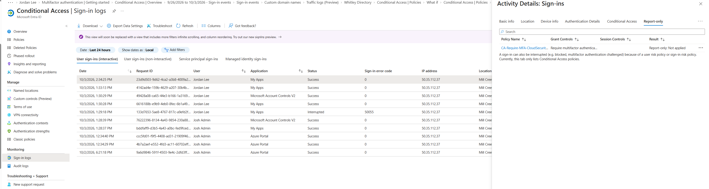

This result is consistent with the resource-scoped design of the policy.

The examined authentication event involved **My Apps**, while the Conditional Access policy was specifically scoped to the **Cloud Security Assessment Portal**.

Because Conditional Access evaluates the complete context of an authentication event, membership in the targeted security group alone does not cause the policy to apply.

The target resource must also match.

Conceptually:

```text
Jordan Lee
    ↓
Member of SG-CA-MFA-Required
    ↓
User Scope = MATCH

My Apps authentication event
    ↓
Target Resource ≠ Cloud Security Assessment Portal
    ↓
Resource Scope = NO MATCH

Result:
Policy does not apply to that event
```

This demonstrates the difference between a policy being incorrectly configured and a policy being correctly excluded from an authentication event because its assignment conditions were not satisfied.

---

# Validation Summary

| Test | Result |
|---|---|
| Finance test identity created | ✅ |
| MFA security group created | ✅ |
| Jordan added to MFA group | ✅ |
| Conditional Access scoped to group | ✅ |
| Protected application scoped | ✅ |
| MFA grant control configured | ✅ |
| Policy deployed in Report-only mode | ✅ |
| What If policy evaluation | ✅ Policy matched |
| Application visible to Jordan | ✅ |
| Application launch | ⚠️ SSO not configured |
| Sign-in telemetry investigated | ✅ |
| Report-only behavior analyzed | ✅ |

---

# Security Findings

## 1. Conditional Access Depends on Context

A user being included in a Conditional Access policy does not mean the policy applies to every authentication performed by that user.

Policy evaluation can depend on multiple signals, including:

- User or group
- Target resource
- Client application
- Device state
- Location
- Risk
- Authentication context

In this lab, both the **identity scope** and **resource scope** were important.

---

## 2. Report-Only Deployment Reduces Implementation Risk

Deploying the policy in Report-only mode provided an opportunity to validate expected behavior before enforcement.

This is safer than immediately enabling a newly created Conditional Access policy and potentially affecting legitimate user access.

---

## 3. What If and Sign-In Logs Serve Different Purposes

The **What If** tool validates how Conditional Access should evaluate a specified scenario.

**Sign-in logs** provide telemetry showing what occurred during actual authentication activity.

Using both provides stronger evidence than relying only on the policy configuration screen.

---

## 4. Application Failures and Conditional Access Failures Are Not the Same

The Cloud Security Assessment Portal launch failed because SSO was not configured for the enterprise application.

That application configuration issue should not be misrepresented as successful MFA enforcement or as proof that Conditional Access failed.

Identifying the difference between these failure domains is an important part of troubleshooting identity systems.

---

# Security Principles Demonstrated

## Group-Based Policy Assignment

Conditional Access was assigned through a security group rather than directly to an individual identity.

This supports scalable identity and access management.

## Scoped Security Controls

The MFA requirement was limited to a designated user population and protected resource rather than broadly applied without validation.

## Defense in Depth

Multifactor authentication provides an additional authentication factor beyond a password when accessing protected resources.

## Safe Deployment

Report-only mode was used before enforcement to reduce operational risk.

## Control Validation

The What If tool was used to verify that the intended policy would match the designed authentication scenario.

## Security Monitoring

Microsoft Entra sign-in telemetry was reviewed to understand actual policy evaluation behavior.

## Evidence-Based Troubleshooting

The application launch error, Conditional Access configuration, What If result, and sign-in telemetry were evaluated separately rather than assuming that one failure explained the entire authentication path.

---

# IAM and GRC Perspective

This lab also demonstrates concepts relevant to IAM governance and security control assurance.

A technical control should have:

```text
Business Requirement
        ↓
Defined Population
        ↓
Protected Resource
        ↓
Security Control
        ↓
Controlled Deployment
        ↓
Validation
        ↓
Monitoring
        ↓
Evidence
```

For this scenario:

```text
Protect cloud application
        ↓
SG-CA-MFA-Required
        ↓
Cloud Security Assessment Portal
        ↓
Require MFA
        ↓
Report-only
        ↓
What If validation
        ↓
Sign-in log review
        ↓
GitHub evidence
```

From a GRC perspective, screenshots and validation results provide evidence that the control was not simply configured, but also reviewed and tested.

---

# Technologies Used

- Microsoft Entra ID
- Microsoft Entra Conditional Access
- Microsoft Entra Security Groups
- Microsoft Entra Enterprise Applications
- Multifactor Authentication (MFA)
- Conditional Access What If
- Microsoft Entra Sign-in Logs
- Microsoft My Apps
- GitHub

---

# Key Takeaways

1. **Conditional Access is policy logic, not simply an MFA switch.**
2. **Group-based targeting provides more scalable access-control administration than individual assignments.**
3. **Target-resource scope matters when interpreting why a policy did or did not apply.**
4. **Report-only mode provides a safer method for evaluating new policies before enforcement.**
5. **What If testing should be paired with actual authentication telemetry whenever possible.**
6. **Application configuration problems should be distinguished from identity-policy problems during troubleshooting.**
7. **Security controls should be documented with evidence showing configuration, validation, and investigation.**

---

# Project Outcome

The lab successfully demonstrated the design and pre-enforcement validation of a **group-scoped Microsoft Entra Conditional Access policy configured to require MFA for a specific protected cloud application**.

The policy was validated using Microsoft Entra's **What If** tool while remaining safely in **Report-only mode**.

A subsequent real-world application test exposed an unrelated SSO configuration limitation. Microsoft Entra sign-in logs were then used to investigate the authentication activity and explain why the resource-scoped policy did not apply to the observed My Apps event.

Rather than treating configuration as the end of the project, the lab followed a broader security engineering workflow:

**Design → Configure → Scope → Validate → Test → Troubleshoot → Investigate → Document**

This project provides hands-on evidence of Microsoft Entra Conditional Access, MFA policy configuration, group-based policy assignment, cloud application scoping, pre-enforcement validation, authentication troubleshooting, security telemetry analysis, and control documentation.
